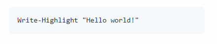

# Welcome  to the Octopus basics workshop!

This training workshop is designed to build a fundamental understanding of Octopus Deploy, its place in the CI/CD ecosystem, and the value it provides to a typical deployment pipeline workflow.

The workshop will teach you the basics by using Octopus Deploy to deploy a web application to some infrastructure where you can see it running.

## Goals and outcomes
- to understand and speak confidently about where Octopus Deploy fits into the CI/CD process
- to understand the overall value proposition of the Octopus Deploy product
- ability to explain the core features
- ability to perform a basic demo of the product

## Guided Workshop
This workshop is normally delivered as a guided experience. This provides the students with 
- an introductory discussion about the concepts 
- an implementation demonstration of the concepts
- a hands on exercise mirroring the demonstration

You can find the slides for the workshop at the following URL:

https://docs.google.com/presentation/d/1RE1cpKfioSquK9h-HH6jxqrbRpw4WQff4TxOJTCD2ww/edit#slide=id.p

The lesson instruction pages have links directly to the first relevant slide in the presentation for your reference.

# Workshop Info

If you are viewing this as a student on your branch, these instructions have been customized for you. Here you'll find a quick reference to the important information about your customized workshop experience. You can refer to this page for the general links you'll need to visit during the workshop.

*If viewing these instructions on the `main` branch, you'll see some placeholders in various places. Many are in links that will not work.*

## Student ID "Slug"

The setup for your experience in this workshop has created a number of resources for your use. Most of these are identified uniquely for you using an ID "slug". This is a text identifier made up of parts of your name and a unique generated ID (to avoid any possible collisions between student names).

Your slug is: ``

This value will show up in some lessons when you need to select resources from a list.

## GitHub Branch

A new branch has been created for you in the GitHub workshop repository. You won't be doing a lot here, but it serves as a component of the workshop activities and you may be returning to it towards the end to make a modification or two. It's yours, so don't worry about messing anything up for anyone else.

Chances are, you're already viewing these instructions on your branch but for your reference, here is its URL:

https://github.com/OctopusDeploy/training-workshop/tree/student/

## Octopus Space

A new Space inside the Octopus Deploy workshop training Cloud instance has been created for you. This is where you'll spend most of your time performing the tasks that make up the workshop lessons.

https://octopus-training.octopus.app/app#/

You can get into this by logging in with your Microsoft account.
- Use the `Sign in with Microsoft` button.
- If prompted to permit access, please accept it.

Please ensure you can access the Octopus instance before you join the workshop.

## Azure Web Sites

Finally, several web site services hosted in Azure have been set up to serve as the infrastructure to which you'll be deploying the workshop's sample web application. Right now they have just the default web application Microsoft provides when you first stand up one of these services. But as you complete the lessons they'll contain the workshop's sample application.

Hosting services have been created to represent the typical environments a software development team would deploy to. Here are the unique URLs for your instances of these services for each of the environments:

- `Development`: [student-app-url-dev]
- `Test`: [student-app-url-test]
- `Production`: [student-app-url-prod]

You'll find links to these applications throughout the workshop when you need to visit them again to see the results of the actions you've performed.

# Styles
Throughout the lessons, you'll see several styles to assist you with the activities.

Direct actions you need to take appear as a bullet list item
- Go here, do this

Names of things in the user interface (menu items, buttons, labels, field names) appear `like this`. Some examples:
- Click the `Save` button
- Navigate to the `Projects` > `Overview` area
- In the `Name` field ...

Most values you should enter as-is appear as a code block like this:
```
some value
```

# Tips

## Copy Values
When instructed to enter values, you should enter them as-is. Some values need to match up with things already provided in the workshop resources.

While viewing on GitHub, you can hover over the code block to reveal the copy button. Use this to easily copy the value to prevent typos.



## Use Additional Tabs
These instructions include links to pages you'll need to visit to complete tasks. Open these in new tabs so you don't lose your place.

# Lesson Plan

This workshop is split into a few parts with a few lessons each.

## Part 1 - The basics of Octopus

- Lesson 1: [Application build and artifacts](part-1-lesson-1.md)
- Lesson 2: [Infrastructure and Environments](part-1-lesson-2.md)
- Lesson 3: [Project and Process Setup](part-1-lesson-3.md)
- Lesson 4: [Deploying an Application Package](part-1-lesson-3.md)
- Lesson 5: [Environment progression and enforcement](part-1-lesson-5.md)
- Lesson 6: [Package and Release Versions](part-1-lesson-6.md)
- Student Demos: [Perform mock demos to demonstrate learned concepts](part-1-student-demos.md)

## Part 2 - More nuts and bolts
- Lesson 1: [Scoping Environment Behavior](part-2-lesson-1.md)
- Lesson 2: [Variables](part-2-lesson-2.md)
- Lesson 3: [Application Variables](part-2-lesson-3.md)
- Lesson 4: [Scoped Variables](part-2-lesson-4.md)
- Lesson 5: [Library Variable Set](part-2-lesson-5.md)
- Student Demos: [Perform mock demos to demonstrate learned concepts](part-2-student-demos.md)

## Part 3 - Bonus Lesson
- Bonus Lesson: [Continuous Delivery and Deployment](part-3-lesson-1.md)

# Before your session
## Watch Sample Demo
Please watch [this quick sample demo video](https://drive.google.com/file/d/1ejl6Ma0GGYmYYCXXSth7TxkGmB5La_2P/view?usp=sharing). You aren't expected to learn directly from this, it's just to help set the stage as an example of the kind of quick demo we would give to a prospective customer.

## Test your Octopus access
Ensure that you can access your Octopus sandbox area. See the [Octopus Space](#octopus-space) section above.

# Let's Go!

It's time to dive into the first lesson: [Application build and artifacts](part-1-lesson-1.md)
