# Part 1 - Lesson 1: Application build and artifacts
- Time: ~30 - 45 min

## Objectives
- Understand a basic example of where an application comes from
- Understand what kind of artifact results from an application build
- Understand where that artifact goes

## Tasks
- Run a predefined application build in GitHub actions
- Verify the package is in your Octopus Deploy artifact feed

## Achievement
- The application package is visible in your Octopus package library

# Lesson

## Run application build workflow

### Navigate to the GitHub Action workflow

In the GitHub repository top menu

- Click on the `Actions` tab (open in a new browser tab so you don't loose your instructions)

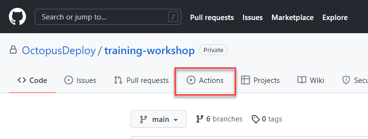

- Click on `Build Application`

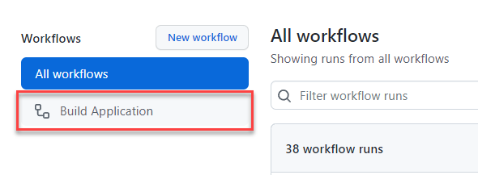

(Or visit the workflow directly: https://github.com/OctopusDeploy/training-workshop/actions/workflows/build-application.yml)

From the `Build Application` workflow view

- Click `Run workflow`. A small dialog will open.

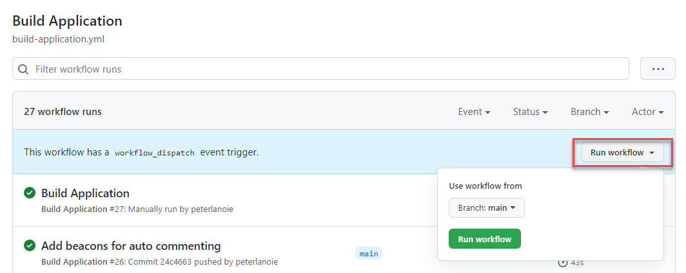

- ***IMPORTANT!***: Look for and select your branch name from the `Use workflow from` dropdown: `student/[student-slug]`

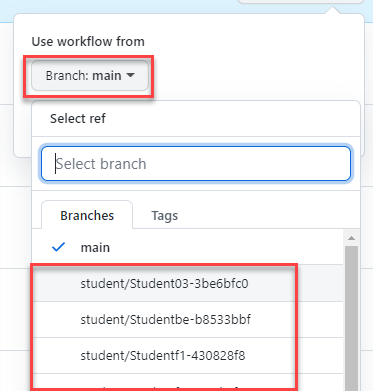

Once your student branch is selected

- Click `Run workflow`

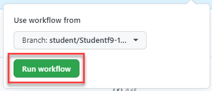

After a short time, you should see a new workflow run show up in the run list with your name listed.
```
Manually run by {your name}
```

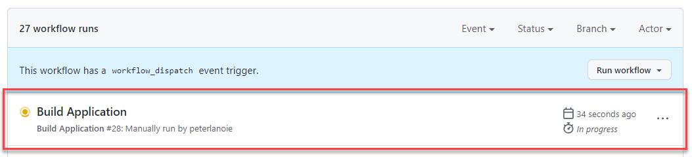

- Click on the `Build Application` title for the entry with your name

- Click on the block labeled `build`

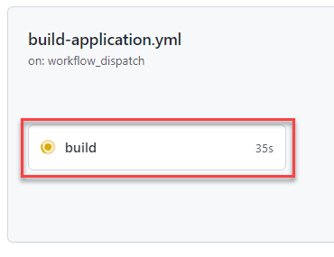

You should now see the activity log of the running application build.

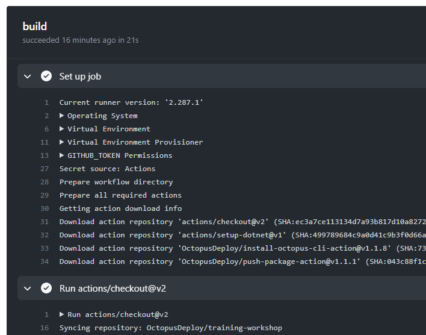

Once everything is finished running, the build should indicate that it's completed and good.

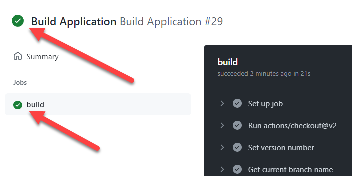

## Verify the artifact in your package feed

- Visit your Octopus Space package repository: https://octopus-training.octopus.app/app#/[space-id]/library

From your Space, you'll find this under `Library` > `Packages`.

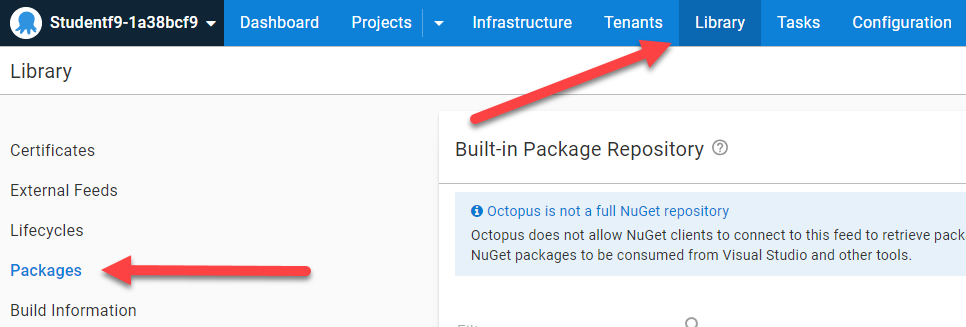

- Verify that you have a package entry with a `Highest version` that has a number with this pattern:
```
{year}.{month}.{day}.{workflow run number}
```
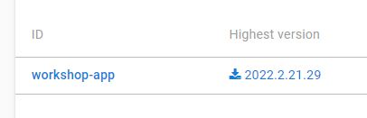

# Lesson Completed!

On to the next lesson: [Infrastructure and Environments](part-1-lesson-2.md)