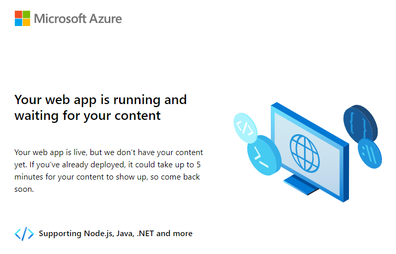
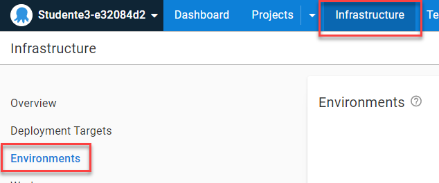

[Previous Lesson](part-1-lesson-1.md)

# Part 1 - Lesson 2: Infrastructure and Environments
- Time: ~15 min

[Presentation Slides](https://docs.google.com/presentation/d/1RE1cpKfioSquK9h-HH6jxqrbRpw4WQff4TxOJTCD2ww/edit#slide=id.g1185db482c1_0_16)

## Objective
- Understand the concept of “infrastructure awareness”
- Understand the purpose of target roles

## Tasks
- Verify your workshop `Development` web site is running
- Configure your `Development` environment
- Register the `Development` web site target
- Verify infrastructure configuration

## Achievement
- Environment and Target are configured and visible in the overview

# Exercise

## Verify your workshop `Development` app is running

- Browse to your `Development` web site: [student-app-url-dev]
- Verify that it is running with the default Azure web service application. It might look something like this:



## Configure your `Development` environment

- In Octopus Deploy, navigate to `Infrastructure` > `Environments`



You can get there directly: https://octopus-training.octopus.app/app#//infrastructure/environments

- Click `Add Environment` button
- In the `Add environment` dialog box, click the small `Development` link to use that as the value
- Click `Save`

## Configure your `Development` target
- Click `Add Deployment Target` button
- Click `Azure`
- Click the `Azure Web App` box
- Enter the display name as
```
Azure Dev Service
```
- Verify the `Environments` section already has `Development` in it
- Enter the target role value as:
```
workshop-app-service
```
- Click `"workshop-app-service" (add new role)`
- Under the `Account` section, click the dropdown and select `Workshop Azure Account`
- Under `Azure Web App`, click the dropdown and select the item that starts with: `-dev` (this is *your* `Development` environment app service)
- Click `Save` button

## Verify infrastructure configuration

- From the top Octopus menu, click `Infrastructure`
- Verify your Overview contains the following:
  - `Environments (1)`
    - `Development 1`
  - `Deployment Targets (1)`
    - `Azure Web App 1`
  - `Target Status (1)`
    - `Healthy 1`
  - `Target Roles (1)`
    - `workshop-app-service`

# Lesson Completed!
On to the next lesson: [Project and Process Setup](part-1-lesson-3.md)
