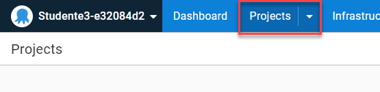

[Previous Lesson](part-1-lesson-2.md)

# Part 1 - Lesson 3: Project and Process Setup
- Time: ~15 min

[Presentation Slides](https://docs.google.com/presentation/d/1RE1cpKfioSquK9h-HH6jxqrbRpw4WQff4TxOJTCD2ww/edit#slide=id.g1185db482c1_0_26)

## Objective
- Understand the basics of deployment process setup
- Complete a deployment

## Tasks
- Create a project
- Create deployment process
- Create a release
- Deploy release
- Observe Project Overview

## Achievement
- Run a deployment that displays a message in the deploy log

# Exercise

## Create a project
***If you get a prompt asking what you're using the project for or what type it is, just dismiss it.***

- From the Octopus menu, click on `Projects`



You can get there directly: https://octopus-training.octopus.app/app#//projects

- Click `Add Project` button
- Enter project name: 
```
Workshop Application
```

## Create deployment process

- Click the `Define Your Deployment Process` button
- Click the `Add step` button
- Click the `Script` step type box
- Click the `Run a Script` box under `Installed Step Templates`
- Under `Execution Location` select `Run once on a worker`
- Under `Inline Source Code` enter the following text:
```
Write-Highlight "Hello world!"
```
- Click `Save`

## Create release

- Click the `Create Release` button (you may need to scroll back up)
- Click `Save` button

## Deploy the application

- Click the `Deploy to Development...` button
- Click the `Deploy` button
- Click the `Task Log` tab to see the details of actions taken during the deployment

The deployment has completed running when
- you see the `Hello world!` message appear
- there's a green box at the top with a checkmark in it

# Lesson Completed!

On to the next lesson: [Deploying an Application Package](part-1-lesson-4.md)
