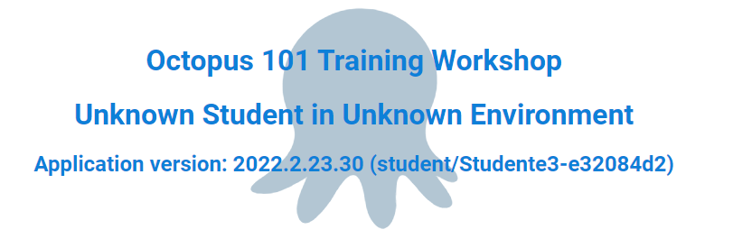

[Previous Lesson](part-1-lesson-2.md)

# Part 1 - Lesson 3: Project Setup and First Deployment
- Time: ~45 - 60 min

[Presentation Slides](https://docs.google.com/presentation/d/1RE1cpKfioSquK9h-HH6jxqrbRpw4WQff4TxOJTCD2ww/edit#slide=id.g1140cf5d16e_0_155)

## Objective
- Understand the basics of deployment process setup
- Complete a deployment

## Tasks
- Create a project
- Create deployment process
- Create a release
- Deploy release
- Observe Project Overview

## Achievement
- Visit your `Development` web site and see the deployed application running

# Exercise

## Create a project
- From the Octopus menu, click on `Projects`

You can get there directly: https://octopus-training.octopus.app/app#/[space-id]/projects

- Click `Add Project` button
- Enter project name: `Workshop Application`

## Create deployment process

- Click `Define Your Deployment Process` button
- Click `Add Step` button
- Click on the `Azure` box
- Under `Installed Step Templates` click `Deploy an Azure App Service`
- Scroll down to `On Behalf Of`
- From the dropdown, select `workshop-app-service`
- Scroll down to the `Deployment` section
- Under `Package` click in the `Package ID` entry and select `workshop-app` from the list
- Click `Save` button

## Create release

- Click the `Create Release` button (you may need to scroll back up)
- Click `Save` button

## Deploy the application

- Click the `Deploy to Development...` button
- Click the `Deploy` button
- Click the `Task Log` tab to see the details

Once the deployment has completed running
- Verify there's a big green box with a checkmark at the top
- Navigate to or refresh your `Development` web site: [student-app-url-dev]
- Verify that the workshop sample application is running on the web site. It should look similar to this:

## Observe Project Overview

- Navigate to the project overview
  - Click `Projects` then `Workshop Application` or
  - Go directly there: https://octopus-training.octopus.app/app#/[space-id]/projects/workshop-application/deployments
- Observe the project dashboard showing the release deployed to `Development`

# Lesson Completed!

On to the next lesson: [Environment progression and enforcement](part-1-lesson-4.md)
