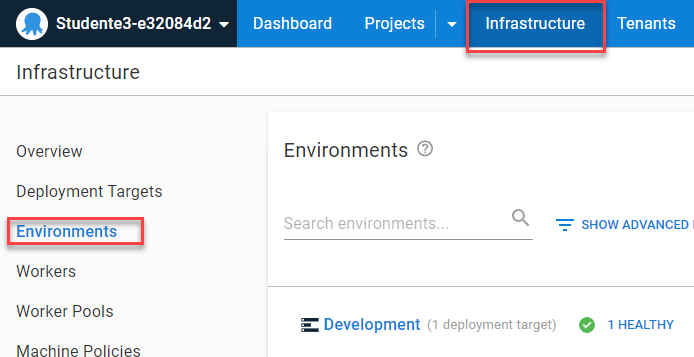

[Previous Lesson](part-1-lesson-3.md)

# Part 1 - Lesson 4: Environment progression and enforcement
- Time: ~30 min

## Objective
- Understand the purpose and importance of different deployment environments
- Understand the importance of a single deployment process
- Understand the importance of environment progression and how Octopus enforces it

## Tasks
- Configure `Test` and `Production` environments
- Verify `Test` and `Production` web sites are running
- Deploy to `Test` and `Production` environments

## Achievement
- See the deployed applications running in `Test` and `Production` environments

# Lesson

## Configure `Test` and `Production` environments

- Navigate to the `Infrastructure` > `Environments` area. (go [directly there](https://octopus-training.octopus.app/app#/[space-id]/infrastructure/environments))

- Repeat the `Configure your Development environment` and `Configure your Development target` steps from [Lesson 2](part-1-lesson-2.md#configure-your-development-environment) to create environments with deployment targets for `Test` and `Production` instead of `Development`.

*Hint: start with the `Add Environment` button.*

Use these variations in place of those in the Lesson 2 instructions:

- In the `Add environment` prompt, use the `Test` and `Production` helper links
- In the `Create Azure Web App` screen:

| Entry | `Test` | `Production` | (note) |
|-|-|-|-|
| Display Name | `Azure Test Service` | `Azure Prod Service` | |
| Environments | `Test` | `Production` | |
| Target Roles | - | - | select existing role: `workshop-app-service` |
| Azure Web App | `[student-slug]-test` | `[student-slug]-prod` | |

Verify your configuration:
- Navigate to `Infrastructure` > `Overview` ([go directly there](https://octopus-training.octopus.app/app#/[space-id]/infrastructure/overview))
- Verify that you now have the following updates:
  - `Environments (3)`
    - `Development 1`
    - `Test 1`
    - `Production 1`
  - `Deployment Targets (3)`
    - `Azure Web App 3`
  - `Target Status (3)`
    - `Healthy 3`

## Observe additional environments

- Navigate to the workshop application project overview
  - Click `Projects` then `Workshop Application` or 
  - [Go directly there](https://octopus-training.octopus.app/app#/[space-id]/projects/workshop-application/deployments)
- Notice that you now have the `Test` and `Production` environments
- Notice there's a `Deploy...` button under `Test`, but not under `Production` for the release

## Verify `Test` website is running and empty

- Browse to your `Test` environment web site: [student-app-url-test]
- Verify that it is running the Azure default web site

## Deploy to `Test`

- Click the `Deploy...` button under `Test`

On the next screen (`Deploy release`)
- Under `Preview and customize` click the row with `Test` in it
- Under `Deployment steps preview`, observe that it shows the name of the target this will deploy to: `Azure Test Service`
- Click the `Deploy` button

Once the deployment to `Test` is complete
- Navigate to your `Test` web site: [student-app-url-test]
- Verify it is now the workshop sample application

## Verify `Production` website is running and empty

- Browse to your `Production` environment web site: [student-app-url-prod]
- Verify that it is still running the Azure default web site

## Deploy to `Production`

In the Octopus portal
- Return to the [`Projects` > `Workshop Application` overview page](https://octopus-training.octopus.app/app#/[space-id]/projects/workshop-application/deployments)
- Notice we now have a `Deploy...` button under `Production`
- Click the `Deploy...` button
- Observe the `Azure Prod Service` target under the `Preview and customize` section
- Click `Deploy` to complete the `Production` environment deployment

Verify the deployment:
- Browse to or refresh your `Production` environment web site: [student-app-url-prod]
- Verify that it is now running the workshop sample application

**Congratulations! You've completed your first deployment through to Production!**

# Lesson Completed!
On to the next lesson: [Package and Release Versions](part-1-lesson-5.md)