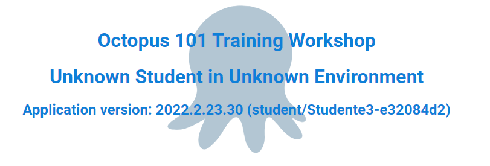

[Previous Lesson](part-1-lesson-3.md)

# Part 1 - Lesson 4: Deploying an Application Package
- Time: ~15 min

[Presentation Slides](https://docs.google.com/presentation/d/1RE1cpKfioSquK9h-HH6jxqrbRpw4WQff4TxOJTCD2ww/edit#slide=id.g118ea6b09cc_1_50)

## Objective
- Understand package deployment
- Understand use of target roles
- Complete a deployment to your website

## Tasks
- Add a step to the deployment process
- Create and deploy a release
- Observe Project Overview
- Verify deployed application on website

## Achievement
- Visit your `Development` web site and see the deployed application running

# Exercise

## Add package deployment

From [your project overview](https://octopus-training.octopus.app/app#/[space-id]/projects/workshop-application/deployments).
- Click on `Process` under the `Deployments` menu
- Click `Add Step` button
- Click on the `Azure` box
- Under `Installed Step Templates` click `Deploy an Azure App Service`
- Scroll down to `Worker Pool`
- The `Runs on a worker from a specific worker pool` radio button should be selected, select `Hosted Ubuntu` from the drop down list
- In `On Behalf Of`, from the dropdown, select `workshop-app-service`
- Scroll down to the `Deployment` section
- Under `Package` click on the `Package ID` entry and select `workshop-app` from the list
- Click `Save` button

## Create release

- Click the `Create Release` button
- Click `Save` button

## Deploy the application

- Click the `Deploy to Development...` button
- Click the `Deploy` button
- Click the `Task Log` tab to see the details

Once the deployment has completed running
- Navigate to or refresh your `Development` web site: [student-app-url-dev]
- Verify that the workshop sample application is running on the web site. It should look similar to this:

## Observe Project Overview

- Navigate to the project overview
  - Click `Projects` then `Workshop Application` or
  - Go directly there: https://octopus-training.octopus.app/app#/[space-id]/projects/workshop-application/deployments
- Observe the project dashboard showing the release deployed to `Development`

# Lesson Completed!

On to the next lesson: [Environment progression and enforcement](part-1-lesson-5.md)
