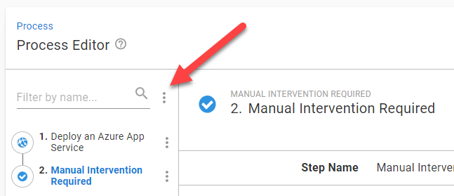

# Part 2 - Lesson 1: Scoping Environment Behavior
- Time: ~45 - 60 mins

## Objective
- Understand the concept of single deployment process and different behaviors based on environments.

## Task
- Modify your deployment process
- Create a new release
- Deploy new release to all environments

## Achievement
- Deployment of the new release to production requires manual approval.

# Lesson

## Modify your deployment process

### Add manual intervention step
- Navigate to your project overview
- Click on `Process` under `Deployments`
- Click on `Add Step`
- Enter `manual` into the filter field
- Click the `Manual Intervention Required` box
- Locate the `Manual Intervention` > `Instructions` section
- Enter an instruction message: `Please approve this deployment`
- Locate the `Responsible Teams` section
- From the dropdown, select `Space Managers`
- Locate the `Conditions` > `Environments` section
- Select `Run only for specific environments`
- From the dropdown, select `Production`

### Reorder steps
- Click the 3 dots next to the filter in the process editor step list

- Click `Reorder Steps`
- Drag the `Manual Intervention Required` step to the top of the list
- Click `Done` and `Save`

## Create new release, deploy through Test

Using what you've learn already
- Create a new release
- Deploy release to Development and Test

## Deploy to production

From your project overview: https://octopus-training.octopus.app/app#/[space-id]/projects/workshop-application/deployments

- Start the deployment to `Production` for the latest (top) release
- Observe that you'll be stopped shortly after the deploy starts and presented with the `Manual Intervention Required` prompt.
- Click `Assign to me` button
- Click `Proceed` button
- Verify the deployment completes

# Lesson Completed
On to the next lesson: [Variables](part-2-lesson-2.md)