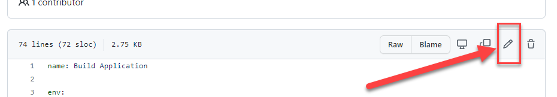
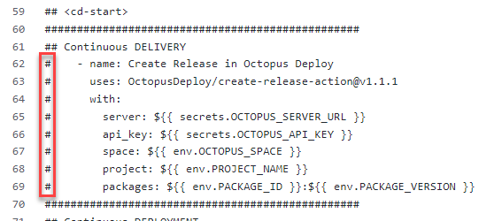

[Previous Lesson](part-2-student-demos.md)

# Part 3 - Bonus Lesson: Continuous Delivery and Deployment
- Time: ~15 mins

## Objective
- Automate all the things

## Task
- Enable continuous delivery of the application package
- Enable continuous deployment to `Development` environment
- Confirm deployment

## Achievement
- New application build lands on the deployment web site without manual steps

# Exercise

## Enable continuous delivery

### Edit the GitHub Actions workflow
- Browse to the GitHub Actions workflow definition file on your student branch: https://github.com/OctopusDeploy/training-workshop/blob/student/[student-slug]/.github/workflows/build-application.yml
- Click the edit pencil at the top right of the file text area



- At the bottom of the file, remove just the `#`s at the beginning of the lines indicated in this screenshot



- Click the green `Start commit` button
- Click `Commit changes`

### Run a new application build
- Go to the GitHub actions `Build Application` workflow: https://github.com/OctopusDeploy/training-workshop/actions/workflows/build-application.yml
- Run the workflow using your student branch: `student/[student-slug]`
- Wait for the run to finish
- Expand the completed `Create Release in Octopus Deploy` step near the bottom
- Look for the last line: `Release x.x.x created successfully!` and note the number
- Return to [your project overview](https://octopus-training.octopus.app/app#/[space-id]/projects/workshop-application/deployments)
- Verify that there is a new release created

## Enable continuous deployment

- Repeat the workflow edit steps above, but this time remove the `#` from just this line:
```
#        deploy_to: Development
```
- Repeat the application build steps above
- Click into the workflow run to see the log, note the number after `Build Application #`
- Note the additional line at the bottom: `Deploying Workshop Application...`
- Return to [your project overview](https://octopus-training.octopus.app/app#/[space-id]/projects/workshop-application/deployments)
- Verify that there is a new release created and that it's showing deploying or already deployed to `Development`
- Browse to your `Development` web site: [student-app-url-dev]
- Verify it's showing the `Application version` number ending in the workflow run number you ran.

# Lesson Completed!
**Congratulations!! You've achieved Continuous Deployment!**